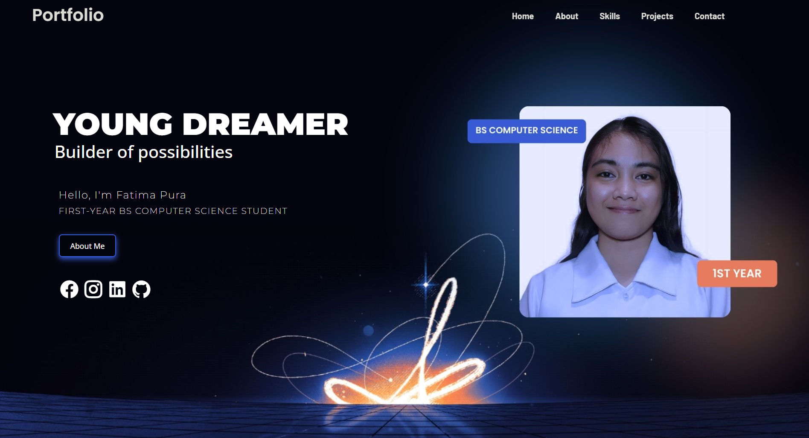
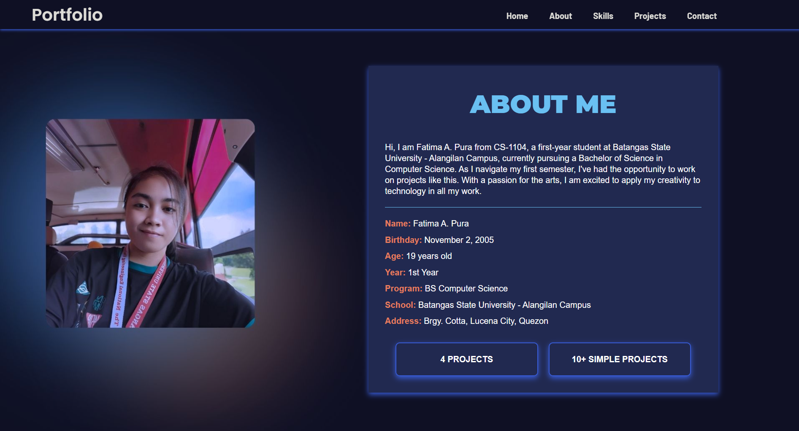
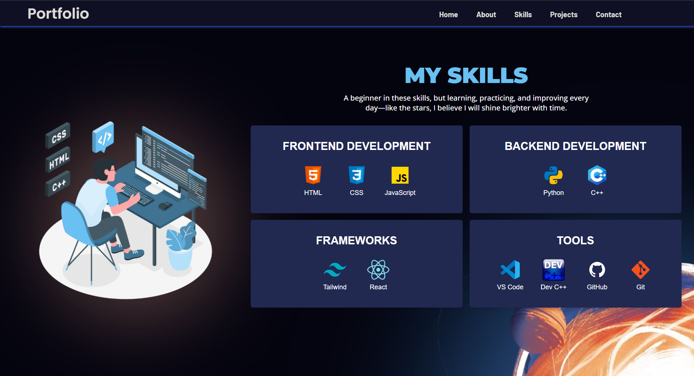
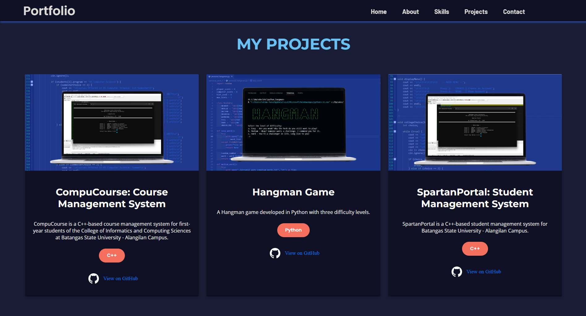
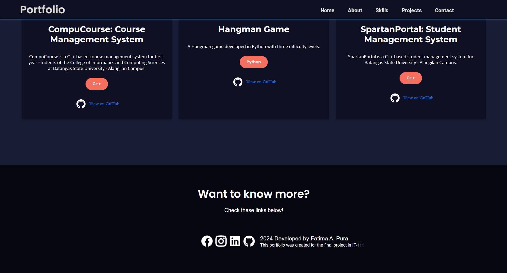

# Fatima Pura's Portfolio

Welcome to my personal portfolio! This website showcases my skills, projects, and contact information. Below are the instructions to help you navigate through it.

## Table of Contents
1. [Home](#home)
2. [About](#about)
3. [Skills](#skills)
4. [Projects](#projects)
5. [Contact](#contact)

## Home
The **Home** section introduces you to who I am. You’ll find my tagline, "YOUNG DREAMER, builder of possibilities" and a brief introduction about myself as a first-year BS Computer Science student. If you'd like to know more about me, click the "About Me" button.

- Links to my social media (Facebook, Instagram, LinkedIn, GitHub) are also available for connection.

## About
The **About** section provides a more detailed description of me, including:
- A brief overview of my background and my current academic journey.
- My name, birthday, age, year, program, school, and address.
- The number of my completed projects.

## Skills
In the **Skills** section, you can see the programming languages and technologies I am practicing and working with:
- **Frontend Development**: HTML, CSS, JavaScript
- **Backend Development**: Python, C++
- **Frameworks**: Tailwind, React
- **Tools**: VSCode, DevC++, GitHub, Git

## Projects
The **Projects** section showcases my notable projects. Each project has a description and a link to the GitHub repository:
1. **CompuCourse**: A C++-based course management system.
2. **Hangman Game**: A Python-based Hangman game with three difficulty levels.
3. **SpartanPortal**: A C++-based student management system.

Click on the GitHub icon to view the project code.

## Contact
The **Contact** section provides links to my social media profiles. Feel free to reach out through these platforms for any inquiries.

---

## How to Use
To navigate the portfolio:
1. **Home**: The landing page with my introduction.
2. **About**: Learn more about my background.
3. **Skills**: Check the programming languages and technologies I'm currently exploring.
4. **Projects**: View details of the projects I've worked on.
5. **Contact**: Connect with me through social media links.

## Technologies Used
- HTML
- CSS
- JavaScript

---

